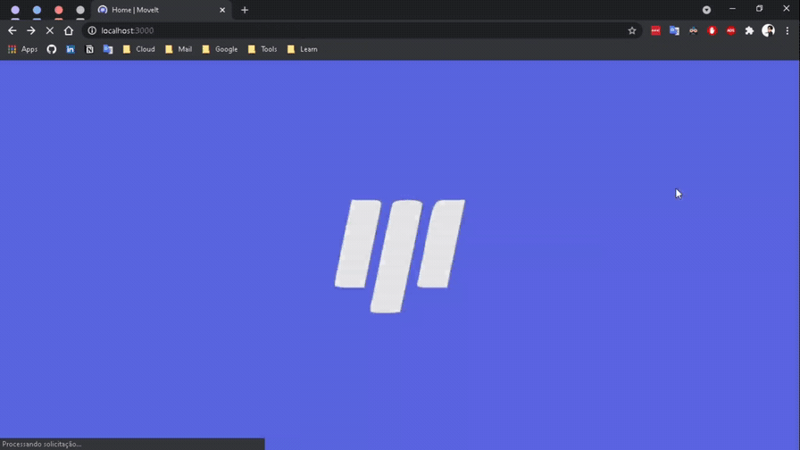

# MoveIt

veja o app em ação:
https://moveit-next-stwgabriel.vercel.app/



## Descrição
O MoveIt é um app de pomodoro que promove produtividade e saúde ao usuario ao implementar um sistema de desafios para o intervalo entre um ciclo de produtividade e outro fazendo com que o usuario possa relaxar durante os intervalos com atividades que o auxiliam.

## O projeto

Este projeto foi desenvolvido em Next.JS utilizando TypeScript e os melhores metodos para obter uma aplicação solida e funcional.

O projeto foi desenvolvido durante a Next Level Week um evento oferecido pela RocketSeat que reune os mais diversos devs para construir uma aplicação com as mais novas formas de desenvolvimento e as melhores tecnologias do mercado mantendo sempre se atualizado, o projeto foi desenvolvido com o auxilio do educador Diego Fernandes.

Este é um projeto educacional de codigo aberto, assim qualquer um pode desenvolver e implementar as funcionalidades de sua vontate.

## Como obter o codigo em sua maquina

Para realizar os processos a seguir você ira precisar utilizar o *Node* e o *yarn* de preferecia as versões mais atuais LTS

### Instalando o node

via gerenciador pacotes

https://nodejs.org/pt-br/download/package-manager/

via download do instalador

https://nodejs.org/pt-br/


### Instalando o yarn

via gerenciador pacotes ou download do instalador

https://classic.yarnpkg.com/en/docs/install/#windows-stable

### passo a passo

Você pode utilizar o ```git clone``` no terminal **git bash** ou um terminal de sua escolha.

EX: ```git clone https://github.com/StwGabriel/moveit-next.git```

Após isso pode usar o ```yarn add``` para instalar as dependencias

agora é so utilizar ```yarn dev``` para iniciar o servidor na sua maquina.

### linguagens e ferramentas utilizadas

</img>
</img>
</img>
</img>


### Social & Profissional

<a href='https://www.instagram.com/stw_gabriel/'></img> </a>
<a href='https://www.linkedin.com/in/stwgabriel/'></img> </a>
<a href='https://github.com/StwGabriel'></img> </a>
<a href='https://www.youtube.com/channel/UCQdFFC-ZOxK7hfsdq5qQ--g'></img> </a>
<a href='mailto:gabbrielsilvactt@gmail.com?Subject=Vim%20Pelo%20GitHub%20/%20I%20came%20through%20GitHub'></img> </a>
